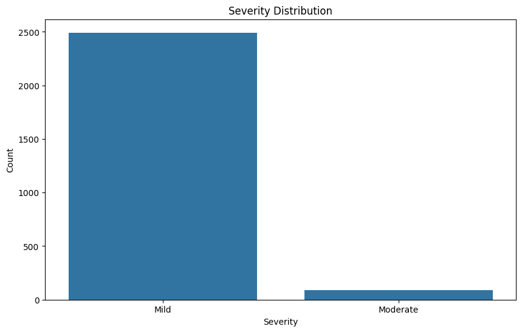
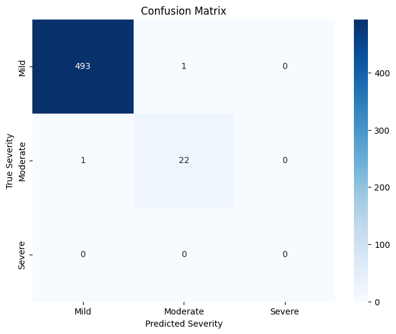
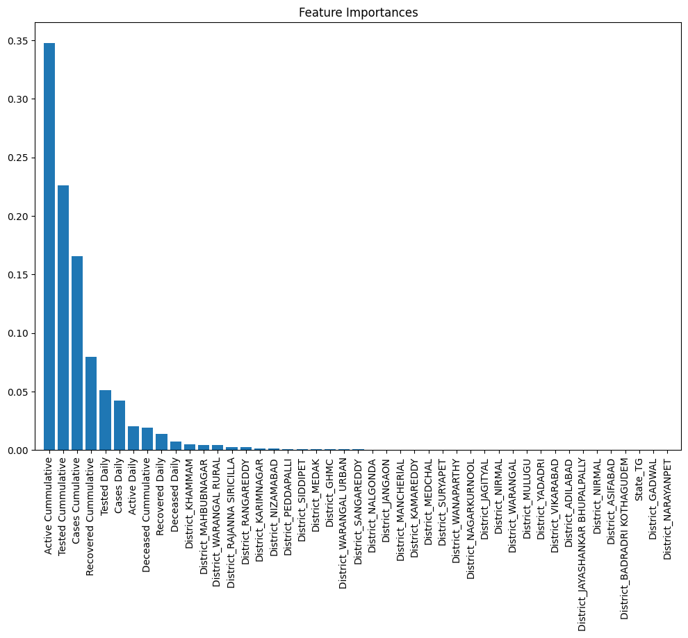
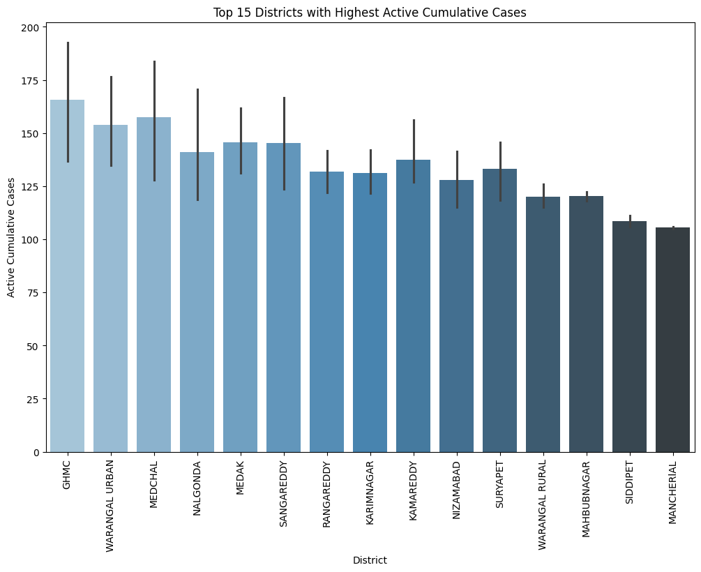
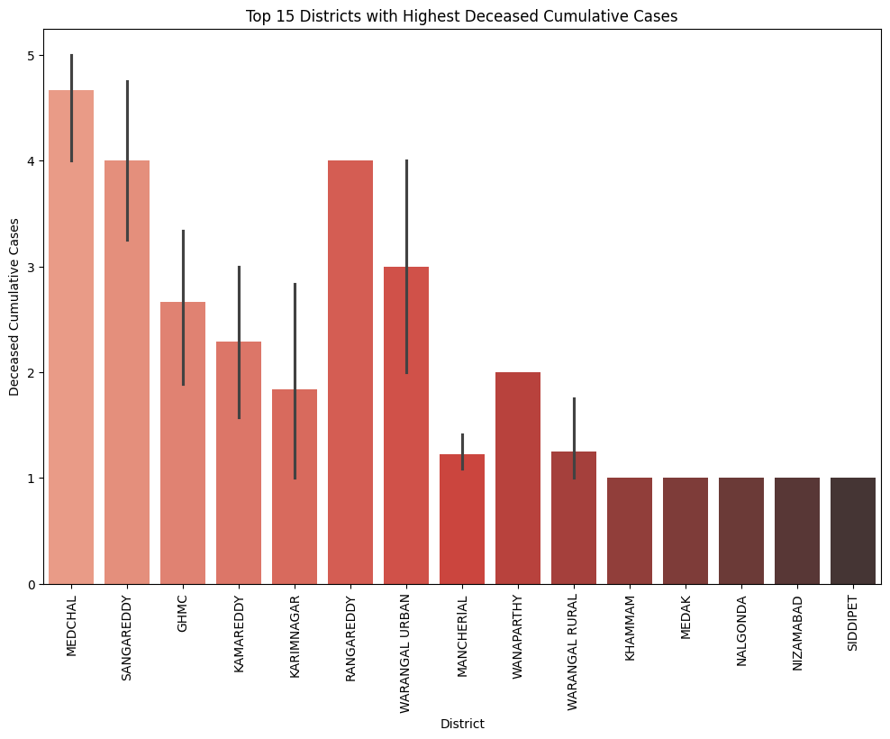

# Predicting COVID-19 Severity Using Machine Learning Algorithms

## Overview

This project aims to develop a predictive model that classifies the severity of COVID-19 spread across various districts based on features such as daily and cumulative cases, active cases, recovered cases, deceased cases, and testing data. The project also visualizes the top 10 districts with the highest active cumulative cases to understand the geographical distribution and intensity of the pandemic.

## Project Details

### Problem Statement

The primary goal of this case study is to create a machine learning model that can classify COVID-19 severity in districts and identify regions with the highest active cumulative cases. This helps in better decision-making and targeted intervention strategies.

### Data Description

- **Sources**: The dataset was collected from multiple sources and stored in an Excel file.
- **Features**:
  - Cases Daily, Cases Cumulative
  - Active Daily, Active Cumulative
  - Recovered Daily, Recovered Cumulative
  - Deceased Daily, Deceased Cumulative
  - Tested Daily, Tested Cumulative
  - State, District

### Data Preprocessing

1. **Loading Data**: Loaded from an Excel file.
2. **Cleaning Data**: Missing values were handled, outliers were removed.
3. **Encoding**: Categorical variables were encoded using one-hot encoding.
4. **Scaling**: Numerical features were scaled using `StandardScaler`.
5. **Defining Severity**: Severity was classified based on active cumulative cases:
   - Severe: > 500 cases
   - Moderate: > 100 cases
   - Mild: ≤ 100 cases

### Model Training

- **Algorithm**: Random Forest Classifier.
- **Training**: Data split into 80% training and 20% testing.
- **Hyperparameter Tuning**: Performed using GridSearchCV.

### Evaluation Metrics

- Accuracy: 99%
- Precision: 99%
- Recall: 99%
- F1 Score: 99%

### Visualizations
# Visualizations

  

  

  

  

- **Severity Distribution**: Shows the distribution of severity levels.
- 
- **Confusion Matrix**: Evaluates model performance.
- 
- **Feature Importance**: Identifies key predictors of severity.
- 
- **Top Districts**: Highlights regions needing immediate intervention.
- 
- 

## Key Insights

- The Random Forest model effectively classifies COVID-19 severity with high accuracy.
- Visualizations help identify critical regions for targeted interventions.
- Machine learning and data visualization are essential for managing infectious disease spread.

## Conclusion

The model demonstrated high accuracy and the ability to provide actionable insights, emphasizing the importance of data-driven approaches in public health.

## Links

- [Colab Notebook](https://colab.research.google.com/drive/1dFoCKGd0OyvRIYKKws04vetSLQg0ZwlJ?usp=sharing)

